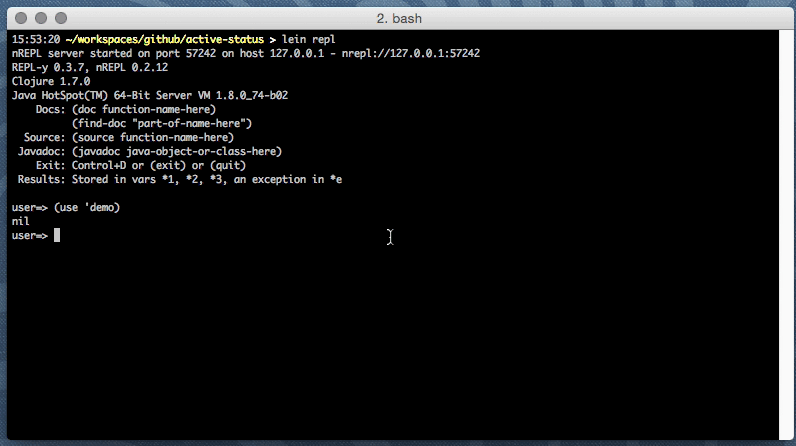

## walmartlabs/active-status

[](http://clojars.org/walmartlabs/active-status)

An update-in-place status board for asynchronous processes inside your Clojure command line application.

You write in Clojure and use [core.async](https://github.com/clojure/core.async).  
Traditional logging is fine for traditional servers, but what if you are writing a command line application?
And what if that application is doing things asynchronously?  What kind of output do you want?

That's what active-status is for; it provides a status board ... console output that updates in-place.
A simple way to let asynchronous jobs report their status and progress.



*Note: progress reporting has changed slightly since this image was created.*

Here's a more realistic example, from [db-migrate-example](https://github.com/hlship/db-migrate-example):


### API Documentation

[API Documentation](http://walmartlabs.github.io/active-status/)

### Example Code

```clojure
(require '[com.walmartlabs.active-status :as as]
         '[clojure.core.async :refer [close! >!!]])

(defn process-files [board-ch files]
  (let [job-ch (as/add-job board-ch)]
      (>!! job-ch (as/start-progress (count files)))
      (doseq [f files]
        (>!! job-ch (str "Processing: " f))
        (process-single-file f)
        (>!! job-ch (as/progress-tick)))
      (close! job-ch)))
      
 (def board-ch (as/console-status-board))
             
 (process-files board-ch (file-seq "process-dir"))                   
```

Of course, this is a simple example. You are more likely to have multiple jobs running at any one time,
of different types, implemented as core.async go blocks, rather than traditional single-threaded code
in this example.


### Limitations


#### tput

Under the covers, active-status makes use of the [`tput`](https://en.wikipedia.org/wiki/Tput) command line tool.
This provides the terminal capabilities (special strings) that allow for moving the cursor around the
screen. It also expects that your console respects standard ANSI codes for formatting (bold and colored
text).

This largely eliminates the use of the library on Windows platforms.

In addition, the library uses italic font for completed jobs ... but even on OS X, Terminal.app
does not support italics out of the box; this [post](https://alexpearce.me/2014/05/italics-in-iterm2-vim-tmux/)
explains how to setup italics. 

[iTerm2](https://iterm2.com/) version 3 does support italics.
It's free and awesome, you should be using this.

#### Terminal width

The library currently doesn't know about the width of the terminal; it will output any job summary text provided, and
may inadvertently wrap the output.

#### Other output
 
The library has no way of determining if some other part of the application is writing to `*out*` or `*err*`.
Any such output will either move the cursor or scroll the screen; the library uses relative cursor motion
when updating a job's line in the status board,
so either of these cases will cause job output to be printed on the wrong lines (lower than expected). 
This is compounded by the fact that job lines are only updated when the underlying data is changed (by sending an 
update to the job's channel).

**TL;DR**: Don't write any output while the status board is running.

### Compatibility

It currently renders quite well in [iTerm](https://www.iterm2.com/).

In Terminal.app, the default terminfo is 'ansi'; the library works correctly only if this is changed to 'xterm' (or some variant).

IntelliJ Terminal (IntelliJ 15, OS X) seems to work fine.

Cursive REPL (Intellij 15, OS X) is currently quite broken, alas.
But, then again, REPL oriented development and the
status tracker are not a good mix (see the "other output" section above).

### Component

The namespace `com.walmartlabs.active-status.component` defines a component that may be used
within a overall component system, which uses configuration to decide whether
to instantiate the console status board, or the minimal status board.
 
See [com.stuartsierra/component](https://github.com/stuartsierra/component) 
and [io.aviso/config](https://github.com/AvisoNovate/config).

### Execution

active-status is intended for long running jobs.
Typically, the deployment model is an Uberjar.
For best execution, use `nohup` and redirect input and output:

    java -jar xxx-standalone.jar ... > console.out 2> console.err < /dev/null & tail -f console.out
    
This will start the application running, and it will continue to completion,
even after a logout.
Output is sent to a file, which can be `tail`ed to see current status.


### Future Directions

More options than the console score board are expected; these might include a pop-up Swing frame, or
a client/server approach (with a server acting as the score board, and providing a web user interface).

A ClojureScript variant, especially one that could work in Node, would be valuable.

----

walmartlabs/active-status is released under the terms of the Apache Software License 2.0.
